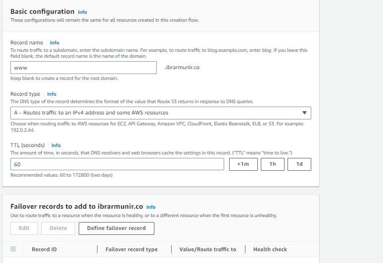

# AWS Route53 Failover Exercise

## Create an EC2 instance and deploy sample react application


## Deploy React application

### Install nvm on the instance

```
curl -o- https://raw.githubusercontent.com/nvm-sh/nvm/v0.39.3/install.sh | bash
```

### Install nodejs

```
nvm install v16.16.0
```

### Install nginx
```
sudo apt install nginx
```

### Open nginx config file which is located at the directory path
```
cd /etc/nginx && sudo nano nginx.conf
```
### Change the nginx.conf file to comment the following


### Create file inside /etc/nginx/conf.d and add the following


### Create a S3 bucket and enable static website hosting


### Add bucket policy for public access

```
{
    "Version": "2012-10-17",
    "Id": "PutObjPolicy",
    "Statement": [
        {
            "Sid": "DenyObjectsThatAreNotSSEKMSWithSpecificKey",
            "Effect": "Allow",
            "Principal": "*",
            "Action": "s3:PutObject",
            "Resource": "arn:aws:s3:::www.ibrarmunir.co/*"
        }
    ]
}
```

### Create a health check in Route53


### Add failover routing policy



